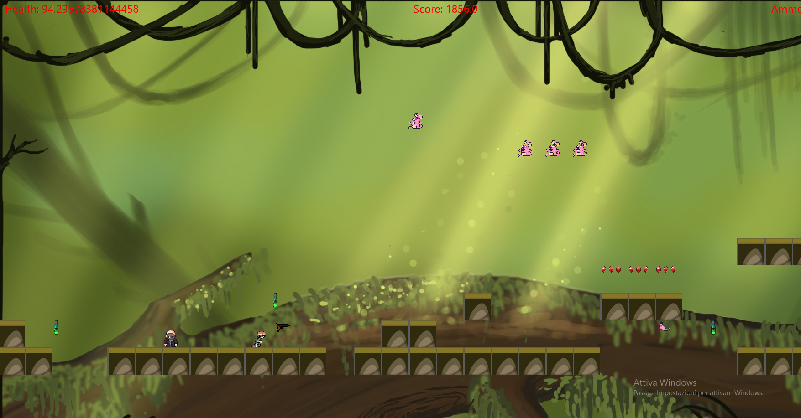
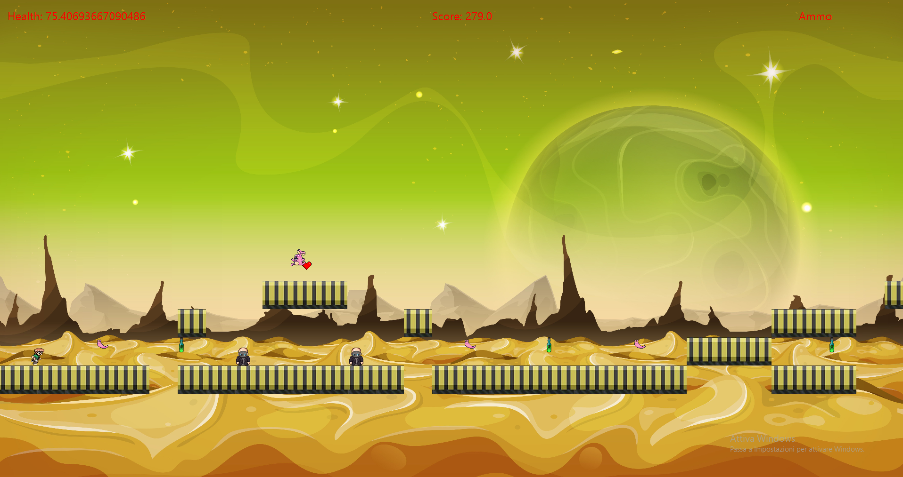
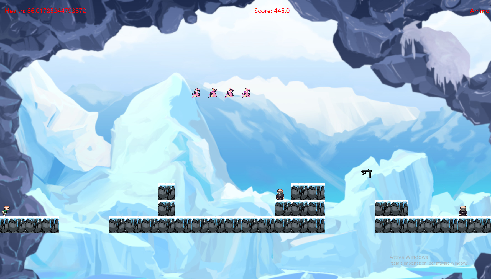
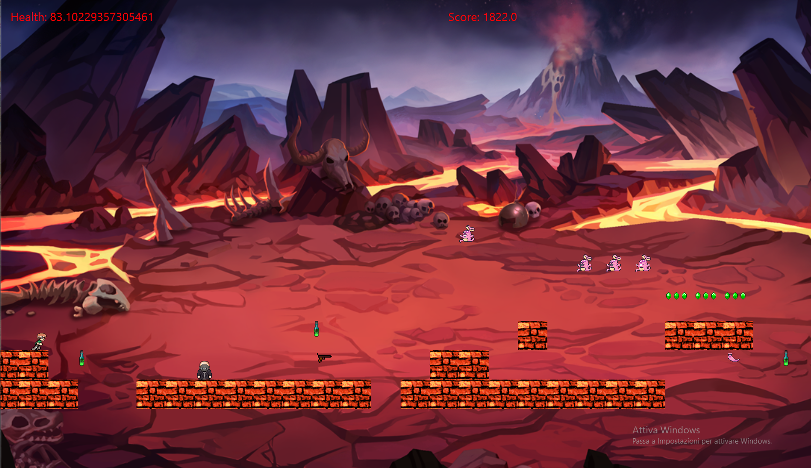
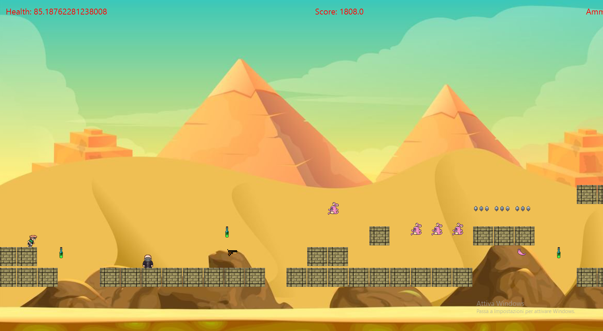
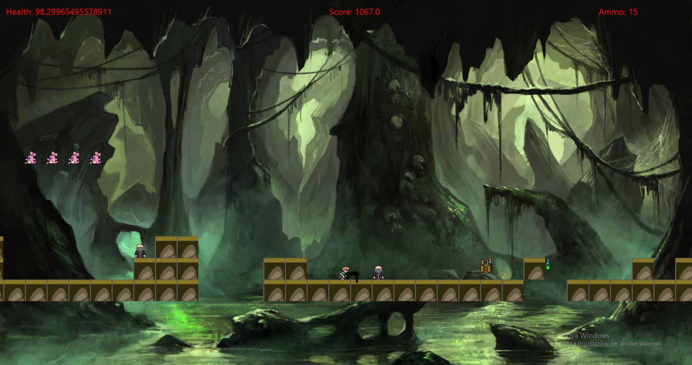
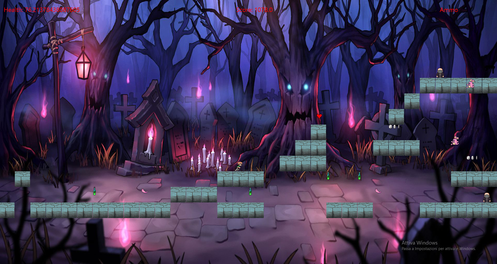

### Bullet Ballet

Bullet Ballet is a 2D platformer developed for a University Project at the _Alma Mater Studiorum_ of Bologna by
	Leon Baiocchi, Alessandro Pioggia, Federico Brunelli, Luca Rengo.

The goal of the game is that of surviving the level's enemies, traps, potions and get to the end of it.
The player is allowed to pickup items that will help him/her to go through the level like weapons, health and coins for the in-game economy.

At the end of the match, the player's name and score will be saved and will be showed in the in-game stats panel.

<!-- TODO: add an image of the game -->

## Requirements

- JDK 11+
- Gradle 8+

## Usage

If the given version contains the jar:

- In the terminal run the command : java -jar bullet-ballet-all.jar

In alternative:

- In the terminal run the command : ./gradlew run -> it requires gradle

## In-Game Commands

- arrows : jump, right and left
- space : shoot

## In-Game Entities
- Player
- Enemies
- Coins
- Weapons:
  - Autogun
  - Shotgun
  - Gun
- Jumping Obstacle
- Items:
  - Poisonous Potions 
  - Hearts
  - Ammo
  - End Game Flag

## In-Game Settings

Through the In-Game Menu you will be able to modify certain settings like:

- Resolution
- Difficulty level
- Volume
- Language:
    - English
    - Italian
    - Spanish
    - German
    - Polish
    - Russian
    - Modern Standard Arabic
    - French
    - Japanese

